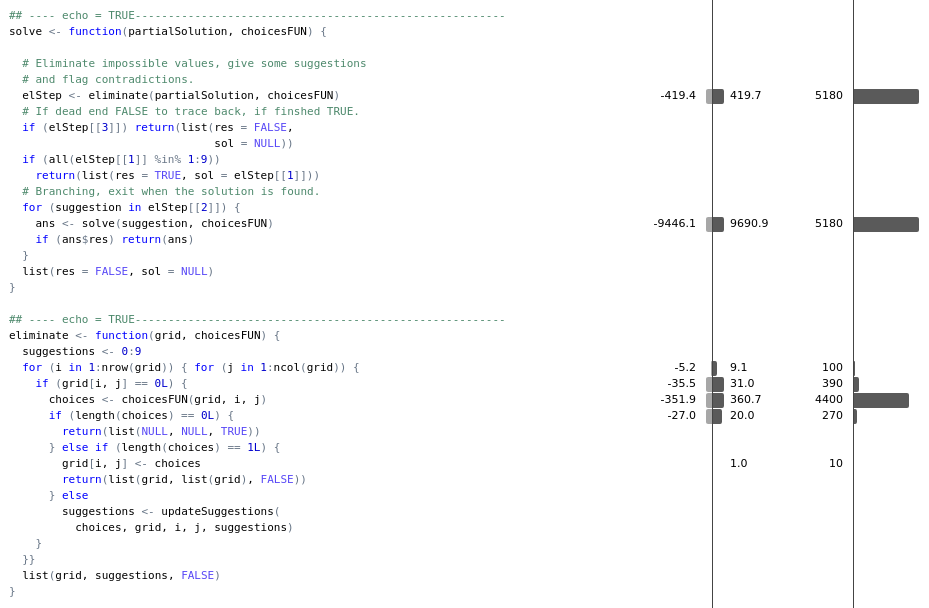
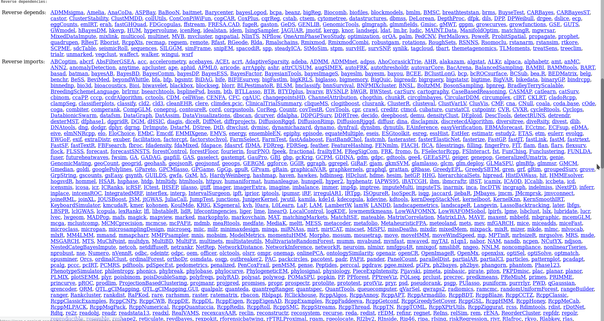

```{r setup, include=FALSE}
knitr::opts_chunk$set(echo = FALSE)
```

## What is a sudoku

The goal of a sudoku puzzle is to fill a $9 \times 9$ grid of cells with 
numbers. At the start the grid will be partially filled and the solver must fill 
all the empty cells according to a set of simple rules:

- Cells may only be filled by the numbers 1 to 9.
- A number may appear only once in each row.
- A number may appear only once in each column.
- The grid is divided in a $3 \times 3$ grid of $3 \times 3$ cells each. In each 
smaller grid a number may only appear once.

## Solving Sudoko's in R and C++

In this presentation two approaches are compared to solve sudoku's:

- R
- Hybrid of R and C++

## Representing a sudoku

A sudoku will be represented by a space separated numbers in 9 rows and 9 
columns. For example (taken from Wikipedia):

```{r, echo = TRUE}
sudokuTxt <- "
1 0 0  0 0 0  0 0 6
0 0 6  0 2 0  7 0 0
7 8 9  4 5 0  1 0 3

0 0 0  8 0 7  0 0 4
0 0 0  0 3 0  0 0 0
0 9 0  0 0 4  2 0 1

3 1 2  9 7 0  0 4 0
0 4 0  0 1 2  0 7 8
9 0 8  0 0 0  0 0 0"
```

0 signifies an empty cell.

## Loading the sudoku

Reading in the sudoku and storing it in a matrix using R is simple:

```{r, echo = TRUE}
sudoku <- as.matrix(
  read.table(text = sudokuTxt, 
             col.names = letters[1:9]))
```

## General solution strategy

A simple idea to algorithm to solve sudoku's is to pick an empty cell fill it
with a valid choice and then repeat this process.

- `findChoices()` is a function that finds possible values for empty cells given
the current grid of numbers.

- A contradiction is found when for a partial solution a cell has _no_ valid 
choices. In this case, this partial solution can never be made a correct 
solution by filling in further cells.

## In R code

```{r, echo = FALSE}
library(zeallot)
library(magrittr)
```
```{r, echo = TRUE}
solve <- function(partialSolution, choicesFUN) {
  # Eliminate impossible values, give some suggestions
  # and flag contradictions.
  c(partialSolution, suggestions, contradiction) %<-% 
    eliminate(partialSolution, choicesFUN)
  # If dead end FALSE to trace back, if finished TRUE.
  if (contradiction) return(list(FALSE, NULL))
  if (all(partialSolution %in% 1:9))
    return(list(TRUE, partialSolution))
  # Branching, exit when the solution is found.
  for (suggestion in suggestions) {
    c(result, solution) %<-% solve(suggestion, 
                                   choicesFUN)
    if (result) return(list(result, solution))
  }
  list(FALSE, NULL)
}
```

## R Implementation - `eliminate()`

The function `eliminate()` checks for every empty cell which values are 
possible, returns a contradiction when no possible values for a cell are found
and keeps track of the cell with the least possibilities which can be used as a
pivot. If only one value is possible it is filled in directly.

## R Implementation - `eliminate()`

```{r, echo = TRUE}
eliminate <- function(grid, choicesFUN) {
  suggestions <- 0:9
  for (i in 1:nrow(grid)) { for (j in 1:ncol(grid)) {
    if (grid[i, j] == 0L) {
      choices <- choicesFUN(grid, i, j)
      if (length(choices) == 0L) {
        return(list(NULL, NULL, TRUE))
      } else if (length(choices) == 1L) {
        grid[i, j] <- choices
        return(list(grid, list(grid), FALSE))
      } else
        suggestions <- updateSuggestions(
          choices, grid, i, j, suggestions)
    }
  }}
  list(grid, suggestions, FALSE)
}
```

## R Implementation - Helpers

```{r, echo = TRUE}
# Find all the choices allowed by the rules.
findChoices <- function(grid, i, j) {
  1:9 %>% setdiff(grid[i, ]) %>%
    setdiff(grid[ , j]) %>%
    setdiff(grid[i - (i - 1) %% 3L + 0:2, 
                 j - (j - 1) %% 3L + 0:2])
}
# Create a list of grids with suggested next moves.
updateSuggestions <- function(choices, grid, i, j,
                              lastBest) {
  if (length(choices) < length(lastBest))
    lapply(choices, function(choice) {
      grid[i, j] <- choice; grid
    })
  else 
    lastBest
}
```

## Solving sudoku's

With this code solving a sudoko is simple:

```{r, echo = TRUE, cache = TRUE}
solution <- solve(sudoku, findChoices)
if (!solution[[1]]) { cat('Solution not found\n')
} else { print(as.data.frame(solution[[2]])) }
```

## or as a picture

\includegraphics[width=220pt]{solved1.png}

## Solving harder sudoku's

This has been called 
``World's hardest sudoku'' (see https://puzzling.stackexchange.com/a/389/7698) 
and we will solve it.

```{r, echo = TRUE}
sudokuTxt <- "
8 0 0  0 0 0  0 0 0
0 0 3  6 0 0  0 0 0
0 7 0  0 9 0  2 0 0
0 5 0  0 0 7  0 0 0
0 0 0  0 4 5  7 0 0
0 0 0  1 0 0  0 3 0
0 0 1  0 0 0  0 6 8
0 0 8  5 0 0  0 1 0
0 9 0  0 0 0  4 0 0"
sudoku <- as.matrix(
  read.table(text = sudokuTxt,
             col.names = letters[1:9]))
```

## Solution to the ``World's hardest sudoku''

\includegraphics[width=220pt]{solved2.png}

## Some benchmarking

Benchmarking using profvis is not so easy due to recursion and the number of 
function calls in zeallot but Rprof in base works fine:

```{r, echo = TRUE, eval = FALSE}
Rprof(tmp <- tempfile())
solution <- solve(sudoku, findChoices)
Rprof()
summaryRprof(tmp)
```

and produces lots of output.

The operators `%<-%` and `%>%` are called a lot and bring a bit of overhead and 
we don't really need them. The code without is shown on the next slides.

## In R code (2), removing `%<-%`

```{r, echo = TRUE}
solve2 <- function(partialSolution, choicesFUN) {
  # Eliminate impossible values, give some suggestions
  # and flag contradictions.
  elStep <- eliminate(partialSolution, choicesFUN)
  # If dead end FALSE to trace back, if finished TRUE.
  if (elStep[[3]]) return(list(res = FALSE, 
                               sol = NULL))
  if (all(elStep[[1]] %in% 1:9))
    return(list(res = TRUE, sol = elStep[[1]]))
  # Branching, exit when the solution is found.
  for (suggestion in elStep[[2]]) {
    ans <- solve2(suggestion, choicesFUN)
    if (ans$res) return(ans)
  }
  list(res = FALSE, sol = NULL)
}
```

## In R code (2), removing `%>%`

The profiling also shows that the of the pipe operator  slows the code down. It
is not necessary either so we sacrifice some readability to get:

```{r, echo = TRUE}
findChoices2 <- function(grid, i, j) {
  setdiff(setdiff(setdiff(1:9,
                    grid[i, ]),
            grid[ , j]),
    grid[i - (i - 1) %% 3L + 0:2,
         j - (j - 1) %% 3L + 0:2])
}
```

## OK, enough talk

show me a benchmark:

```{r, echo = TRUE, eval = TRUE, cache = TRUE}
options(digits = 2)
microbenchmark::microbenchmark(
  pipe = solve(sudoku, findChoices), 
  `no operators` = solve2(sudoku, findChoices2),
  times = 5)
```

This helps but can we do better?

## Let's do another profile

With the zeallot and pipe overhead gone, profiling works again. It shows the
following:



## What now?

It seems hard to improve `findChoices2()` further but we can use C++. It is 
easier than you might expect.

## C++ code

```{Rcpp, echo = TRUE, eval = TRUE, cache = TRUE}
#include <Rcpp.h>
using namespace Rcpp;
IntegerMatrix subGrid(IntegerMatrix& x, int i, int j) {
  i -= i % 3; j -= j % 3;
  return x(Range(i, i + 2), Range(j, j + 2));
}
// [[Rcpp::export]]
IntegerVector findChoicesCpp(IntegerMatrix& x, 
                             int i, int j) {
  IntegerVector candidates(9);
  std::iota(candidates.begin(), candidates.end(), 1);
  // C++ is zero-indexed.
  return setdiff(setdiff(setdiff(candidates, 
          IntegerVector(x(i - 1, _))),
        IntegerVector(x(_, j - 1))),
      subGrid(x, i - 1, j - 1));
}
```

## For comparison

```{r, echo = TRUE, eval = FALSE}
# Find all the choices allowed by the rules.
findChoices2 <- function(grid, i, j) {
  setdiff(setdiff(setdiff(1:9,
                    grid[i, ]),
            grid[ , j]),
    grid[i - (i - 1) %% 3L + 0:2,
         j - (j - 1) %% 3L + 0:2])
}
```

## New benchmark

```{r, echo = TRUE, eval = TRUE, cache = TRUE}
options(digits = 2)
microbenchmark::microbenchmark(
  `no operators` = solve2(sudoku, findChoices2), 
  `C++` = solve2(sudoku, findChoicesCpp),
  times = 10)
```

## This is great, how do I get started

Simply 

```{r, eval = FALSE, echo = TRUE}
install.packages('Rcpp')
```

and then start reading

```{r, eval = FALSE, echo = TRUE}
vignette('Rcpp-introduction')
```

## Who is using it?

CRAN shows a lot packages



but I believe a lot of Rcpp never makes it to CRAN.

## Questions?

Any questions, remarks or observations?

## On GitHub

You  can find this presentation and related materials on

https://github.com/bobjansen/RcppSudoku